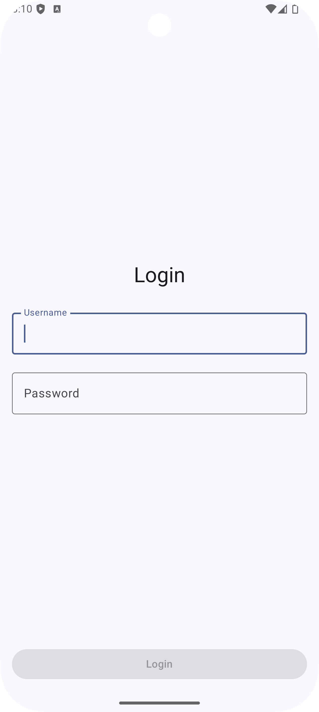
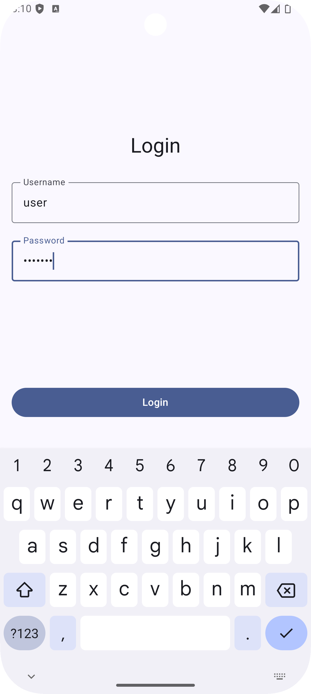

# Login App with Kotlin Coroutines

This is a simple Android app that demonstrates a login process using Kotlin coroutines.

## Features

- **Login Form**: Simple login form with username and password fields
- **Authentication Simulation**: Uses Kotlin coroutines to simulate a network authentication process
- **Loading Indicator**: Shows a loading indicator while authentication is in progress
- **Error Handling**: Displays error messages for failed login attempts

## Architecture

The app follows modern Android development practices:

- **State Management**: Follows unidirectional data flow pattern with Intents
- **MVI Architecture**: Uses ViewModel and StateFlow for UI state management
- **Jetpack Compose**: UI built with Jetpack Compose
- **Kotlin Coroutines**: Used for asynchronous operations

## Usage

To log in successfully, use the following credentials:
- Username: `user`
- Password: `password`

Any other combination will result in a login failure.

## Screenshots

| Default Screen | Valid Login Data |
|:-------------:|:---------------:|
|  |  |
| **Login Error** | **Logged In** |
|  |  |